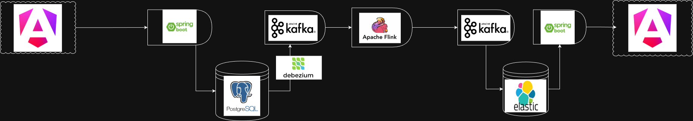
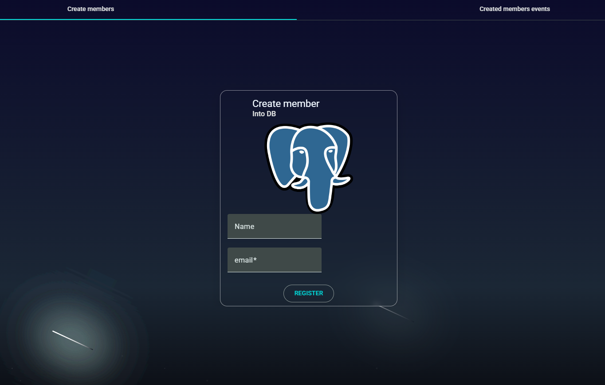

# Training Bench - Technical Data Pipeline Demo

## Overview
This project is a **technical demonstration** of a data pipeline architecture designed to process and monitor:
- Gym members
- Training sessions
- Strength exercises

While the app could have been built as a **simple front-end** or with just **Spring Boot + a database**, the goal here was to gain hands-on experience with **Debezium CDC**, **Kafka**, **Avro serialization**, **Schema Registry**, **Flink ETL jobs**, **Kafka Connect**, and **Elasticsearch**.

The pipeline follows this flow:
1. **PostgreSQL** stores gym-related data.
2. **Debezium CDC** captures changes in PostgreSQL and sends them to **Kafka**.
3. Data is serialized using **Avro** with **Schema Registry**.
4. A **Flink** job processes and re-sinks events back to Kafka.
5. **Kafka Connect** pushes processed events into **Elasticsearch**.
6. **Spring Boot API** queries Elasticsearch and serves data to the **Angular UI**.

Todo:
- "Update" and "delete" pipe still need to be finished, 
- Add workout sessions and exercises data pipeline, 
- Automate flink job jar deployment

## Architecture Diagram


## Screenshot (UI)

---

## Setup

### Prerequisites
- Docker & Docker Compose installed
- Gradle for building the Flink job
- Node.js & npm for the Angular UI (optional for local dev
- Java 17

### Build the Flink Job
Before starting the stack, you must build and export the Flink job JAR.

```bash
cd training-bench/training-bench-flink/training-bench-flink/
./gradlew clean shadowJar
```

The JAR will be located in:
```
training-bench/training-bench-flink/training-bench-flink/build/libs/
```

You will need to **manually upload this JAR** to Flink's Job Manager UI at:
```
http://localhost:8082
```

---

### Start the Stack
Run the following command from the project root:

```bash
docker compose up --build
```

This will start the following services:
- **broker** → Apache Kafka broker
- **kafka-ui0** → Kafka UI for topic management
- **schema-registry** → Confluent Schema Registry
- **postgres** → PostgreSQL database
- **dbz** → Debezium Kafka Connect for CDC
- **jobmanager** & **taskmanager** → Apache Flink cluster
- **elasticsearch** → Elasticsearch node
- **kibana** → Elastic dashboard
- **api** → Spring Boot API
- **ui** → Angular front-end

---

### Accessing Services
- **Angular UI** → [http://localhost](http://localhost)
- **Spring Boot API** → [http://localhost:8084/api](http://localhost:8084/api)
- **Kafka UI** → [http://localhost:8080](http://localhost:8080)
- **Flink UI** → [http://localhost:8082](http://localhost:8082)
- **Kibana** → [http://localhost:5601](http://localhost:5601)
- **Elasticsearch** → [http://localhost:9200](http://localhost:9200)

---

## Notes
- The **UI will not display events** until the Flink job is uploaded and running (and elastic filled).
---

## License
This project is for **educational and demonstration purposes** only.

